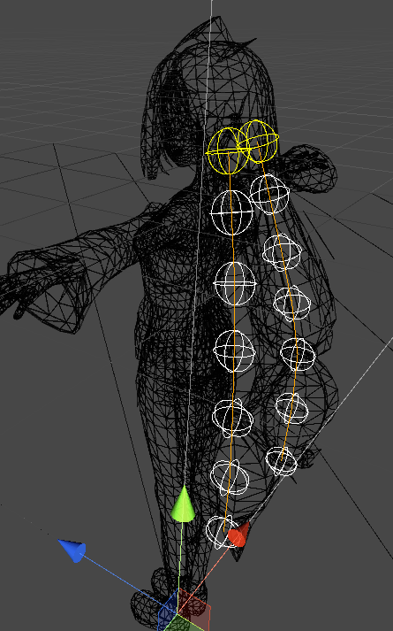
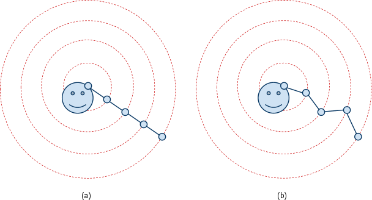
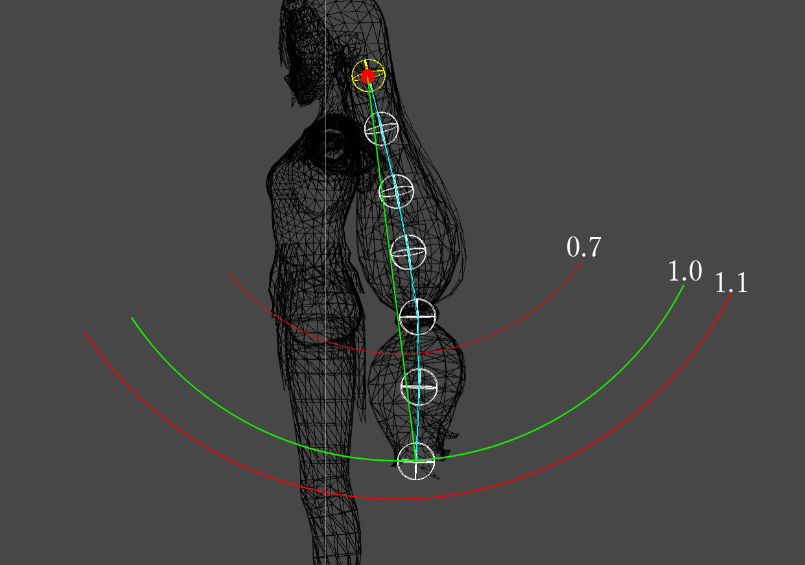

# 在Avatar引擎中使用简单的头发模拟

## Abstract

The most popular solutions for the hair simulation in game engines are force based. Internal and external forces are accumulated from which accelerations are computed based on Newton’s second law of motion. In *Avatar engine*, programmer can develop code within its physics update in each frame (player loop),  therefore, *time integration method* which is to update the velocities and finally the positions of the object in each frame can been used in this game engine. This article will ~~discuss a few hair simulation methods and~~ put forward a method which can run smoothly in *Avatar engine*. This approach has been tested and demonstrates robustness, controllability and  high-efficiency in  *Avatar engine*. Performance analysis and future work also has been risen in section 5 and section 6. In addition, source coed which developed by Lua had been attached in the appendix. \[1][2]

## Introduction

本文提出一种Particle based 的头发模拟方法，并在Avatar引擎中初步实现。本文大致分为2部分，第一部分讨论在部分涉及到的物理特性及其实现细节；第二部分着重分析实现过程中遇到的问题以及性能分析和后续工作。

## Related Works

考虑编辑器目前暂未支持GPU编程，整理了现有在unity中基于CPU计算的头发模拟unity插件：

* [HairStudio](https://assetstore.unity.com/packages/tools/modeling/hairstudio-early-access-now-with-hdrp-164661)

* [DynamicBone](https://assetstore.unity.com/packages/tools/animation/dynamic-bone-16743)

* [MagicaCloth](https://assetstore.unity.com/packages/tools/physics/magica-cloth-160144)

其中[DynamicBone]和[MagicaCloth]是基于头发骨骼模拟，在Avatar引擎中较为容易实现。因此，本文着重参考以上两种头发飘动解决方案，并尝试在引擎中实现。

 

## Hair Simulation

在文中开始前，需要定义一下**头发Particle**。由于本方法参考的是基于质点的位置计算，所以本方法中会把一根（束）头发拆分成若干个质点（图1）。基于Hair Particle的物理计算灵感来源于Particle-based viscoelastic，最初是 Clavet 2005年发表在ACM上的一篇关于液体沾粘性模拟的论文[3]。文章提出用大量微小的可移动的物体之间的吸引和碰撞模拟液体的部分物理特征。在本文中头发可以近似认为**一串有序的Particle串联成的物体**，用Particle之间的引力和碰撞去模拟头发飘动物理特性。

### Physical Property

#### 重力

`重力公式`
$$
G = mg
$$

根据经验，通常g在游戏中不取9.8或10而是远小于该值。因为在现实中，头发的质量m很小，以kg为单位会使得调参非常困难。主流插件对每个头发particle的取值范围限制在[0.01 - 10]之间，通常是[0.1-1]。因此，在物理模拟中，头发受到的重力会明显高于真实情况。为了尽量贴近真实物理，本文提出的方法会从减少g和增加其他约束调节来抵消提高头发质量产生的影响。

关于在编辑器中以*毫克为单位*编辑头发质量的可能性，在本文提出的方法中*不可行*。在编辑器中以毫克为单位编辑头发质量m，可以更加符合真实物理情况以及减少参数编辑的复杂度。但是进过初步尝试，在本方法中并不可行。理由如下：较小的头发质量会对外力作用非常敏感（重力、弹力），在没有引入头发摩擦因数的情况下，微小的风力会对头发particle产生较大的加速度，使得particle偏离稳定位置较多，在下一帧产生的头发弹性约束（会在下个section进行讨论）会对particle施加一个较大的反向加速度，从而使得particle难以维持稳态；其次，在牛顿力学公式计算中，会将毫克转化为千克进行计算，对此需要额外考虑Lua number类型精度的问题。

图2

#### 弹簧质点系统

本系统主要参考Milo的博文 《爱丽丝的发丝》[5]，将一根头发的particles之间通过弹性连接约束在一起。相较于传统的点对点约束和刚性弹簧约束，这种弹簧系统可以更好地模拟头发受力时产生的particle移动。 

`弹簧弹性公式`
$$
F = k * x
$$

在Avatar引擎中添加弹性链接之后，可在游戏视窗中看到头发在重力作用下上下弹动。由于头发不是纯粹的弹簧弹性物体或软体，对拉伸的抵抗会比较高，即头发不容易发生明显的弹性形变，但是我们又需要弹性约束的特性去模拟头发的“柔软”的表现（暂时不探讨刚性弹簧约束）。因此，在不考虑断裂的情况下，本方法尝试放大拉伸距离对弹力影响的比重去优化头发对抗拉扯的表现，简单把公式优化成（其中Δx为平和点的距离差）：
$$
F = 
\begin{cases}
k * \Delta x &(x <= 0)\\
k * \Delta x^2 &(x > 0)
\end{cases}
$$
 

图3

 ##### 弹簧质点系统改进

Milo在博文中提出，相较于“之前的做法，虽然能模拟出一条绳子，但它的行为更像一条锁链，因为它是完全柔软的，而真实的绳子在止动时通常是直线的，弯曲绳子需要施力。一个简单的实现方式是再加入弹簧(长度约束)，连接相隔一个粒子的每对粒子。” 根据Milo提出的思路，本方法对头发particle之间加入一个额外的弹力，这个弹性约束与上上个particle关联（图5）。

在图4中可以看出，在重力和弹性的共同作用下，头发particle在保持上下运动的同时，还一定程度上模拟出了类似“波浪”的波动表现。同时，可以利用改进的弹簧质点系统的特性，部分实现了 `MagicaCloth`插件的`DistanceClamp`特性（图7）。由于这个特性的存在，本方法不做最后的质点位移的clamp。

图4

图5

图6

图7

### 玩家操作/动画影响

在Avatar引擎中测试中发现，大部分情况下头发根节点不是固定不变的，上文的分析都是基于头发根节点不变的情况下讨论的。因此需要最动态模型中综合考虑多种不确定因素对头发位置模拟产生的影响。最常见的就是由玩家输入操作导致的头发根节点移动和自身动画产生的根节点移动。

本方法对应的解决方案是记录每个particle上一帧的位置，并且在当前帧物理计算开始前做对比得出位移差值。位移插值除以两帧之间的时间差即为当前帧由外部行为产生的速度差。这个速度差值会被记录，在最终的位置计算的时候作为一个关键参数参与计算。

然而在实现和调试过程中并非理论上那么理想。由于没有过渡动画的存在，在键盘输入左右位移的时候，角色会生硬地进行左右旋转，这种旋转在计算两帧之间的位移速度会是非常致命的。同理，角色在进行瞬移，传送等操作时，也会出现下一帧速度计算不准确的问题。针对以上情况，需要提前对速度进行clamp。本方法的解决方法是，定义一个*动态阈值*，当由于操作导致的速度差大于这个阈值，直接抛弃这个particle的操作速度差，并且将这个点的弹簧质点系统关闭，启用刚性弹簧约束。图8可以看到，不管角色以何种速度跑动，当前particle和上个particle之间会有一个最大距离，当角色停止跑动或者高速移动后，会逐渐恢复部分弹簧特性。

图8

#### 风力影响

本方法采用最简单的风力影响解决方案，即在每个头发particle上施加方向相同且强度相同的力。这个方法的优点是可以快速计算出单个particle受的力并且得出加速度方向和大小，再根据帧率间隔求算出速度变化的量，这个速度变化可以镜像应用到所有参与受风力影响的头发particle上。这个解决方案配合Lua对数组类型table访问速度快的语言特性，对计算和数据读写速度较为友善，但对头发特性进行真实准确地模拟。如由于物体的遮挡会导致部分头发不会受到风力影响；真实的风并非一个方向固定且力量均匀，会有噪声的存在。

参考MagicaBone插件，会对设置好的风向和风力做周期性地正弦变化，并且可以在编辑器界面调节振幅和周期。本方案会在后续的跟新中加入风力风向模拟的功能。

#### 碰撞

碰撞检测库和碰撞决议是Particle based simulation核心和困难的模块。尝试过添加碰撞以及对应的碰撞反馈逻辑，由于性能问题，最后剥离出了该部分。同理，particle之间摩擦力计算也不在本方法谈论范围之内。会在后续的尝试中找出性能友善的代替解决方案。

#### 能量损耗和风阻

由于采用的是基于particle的计算系统，头发在空气中的横截面积难以精确求得，本方法直接简单讲风阻和能量损耗一并处理。通过公式得出，其中γ为配置的阻尼值。
$$
Speed_{now} = Speed_{base} * ( 1 - \gamma)
$$

### 最终物理计算 

计算当帧由重力产生的速度差，弹性约束产生的速度差，玩家操作产生的速度差，风力产生的速度差，并对所得的结果做累加。得出当帧的合速度差之后可得计算过风阻的最终速度。如果最终速度小于阈值，可以判定当前particle未运动，清空当帧速度缓存并跳过设置position阶段。如果没有小于阈值，通过公式算出这帧平均速度：
$$
\Delta V = (V_0 + V_1)/2
$$
由平均速度求出当帧位移，加上上帧位置得出当帧位置，最后对particle位置进行更新。

 

### Future Work

* 所有的物理计算都是对位移Position进行分析计算，然而头发模拟和骨骼动画重要的另一个参数*旋转* 并未涉及。文本知识初步论证基于Lua的头发模拟在*Avatar*引擎中的可行性。未来的工作可以对头发particle的旋转进行分析计算，并配合骨骼动画，实现视觉上可以接受的头发模拟。
* 引入头发质量曲线参数，支持通过配置指定每个头发particle质量。
* 可以通过减少参加计算particle数量，剩余particle可用曲率插值lerp方法减少计算量。
* 关于弹性计算，只计算了当前particle受到来自上一个particle的拉力/斥力，并未计算当前particle受到下一个particle的拉力/斥力。即只弹性力的反作用力没有计算，考虑到性能相关问题和最终物理模拟表现，在后期优化的时候整体移除了该阶段。
* 引入松弛法，进行多次迭代，尽量满足多个约束。

## Reference

1. Müller M, Heidelberger B, Hennix M, Ratcliff J. Position based dynamics. J Vis Commun Image Represent. 2007;18(2):109–118.

2. Bender J, Müller M, Otaduy MA, Teschner M. Position-based methods for the simulation of solid objects in computer graphics. Paper
   presented at: STAR Proceedings of Eurographics; 2013; Girona, Spain. Aire-la-Ville, Switzerland: The Eurographics Association; 2013.

3. S. Clavet, P. Beaudoin, P. Poulin, Particle-based viscoelastic fluid simulation, Proceedings of the ACM SIGGRAPH Symposium on Computer Animation (2005) 219–228.
4. M. Fedor, Fast character animation using particle dynamics, in: Proceedings of International Conference

5. Milo Yip, 2011, 6, https://www.cnblogs.com/miloyip/archive/2011/06/14/alice_madness_returns_hair.html

## Appendix

[Code here]()